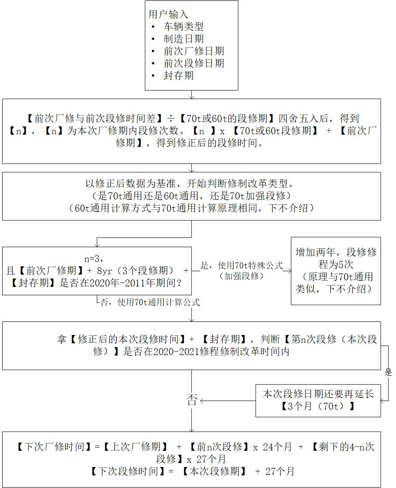
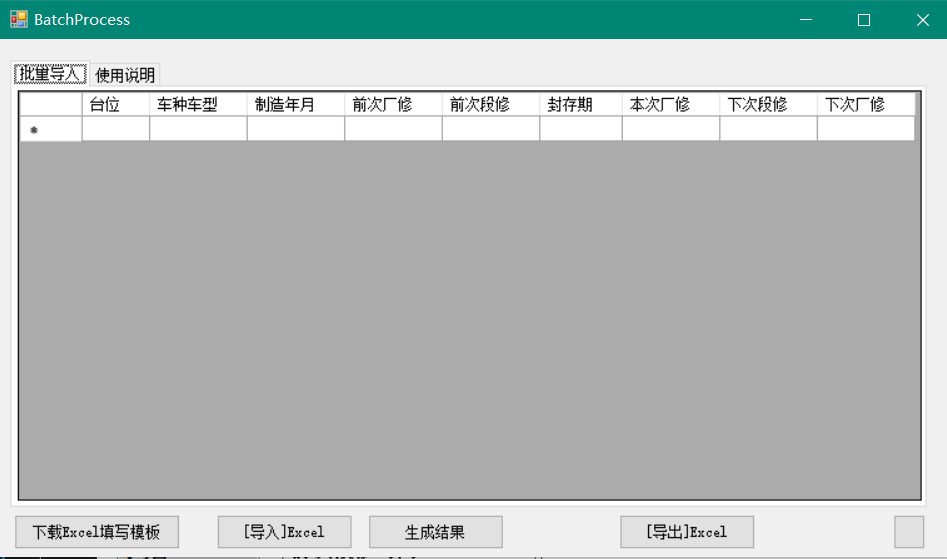

# 中国铁路货车修程修制改革货车定检日期核对软件开发文档

> China Railway Vehicle Rapair Interval Process Program

## 简介 Introduce 

> 自2019年12月国铁集团实施货车修程修制改革后，参与修程修制改革车辆定检标记存在不同程度延期，而HMIS系统计算数据存在少量偏差，人工计算核对日期效率低、出错率高。为防止参与修程修制改革货车标记涂打错误，影响车辆正常检修，本人开发了货车定检日期计算应用程序，以制造日期、前次厂修、前次段修及封存备用期为基准，结合车型厂、段修周期，用前次段修减前次厂修后除以段修周期四舍五入得出已进行段修次数，本次段修开始按照修程修制改革要求延期处理，进而推算出下次段修、下次厂修及过期月份。经车间技术人员计算验证，并与段修日计划数据比对，该应用程序准确率百分之百，极大的减轻了人工计算量，提高了定检标记日期核对效率。

### 基本功能 Basic Function

输入车辆类型、制造日期、前次厂修日期、前次段修日期、封存期（Optional），点击生成即可计算出本次、下次厂段修，以及显示当前所处修程。


程序核心计算流程为：



### 除此之外 Advanced Function

为更方便使用，在单次计算的基础上加入了Excel导入导出功能，批量计算验证。进一步提高工作效率。



## 代码分析
计算核心代码分为两部分

1. 一是内含各项日期参数的车辆模型(VehicleModel)
2. 二是数据处理的计算代码(ProcessKernel)

### 数据模型

其中，数据模型里包含了如下参数：

名称|参数
-|-
车辆类型 | vehicleGenType
制造日期 | produceDate
前次定检段修期 | previousDepotDate
前次定检厂修期 | previousFactoryDate
加强段修日期 | enhanceDepotDate（Optional）
下次段修期 | currentDepotDate
下次厂修期 | nextFactoryDate
封存期 | SealDuration
下下次段修 | vNextDepotDate(Reservered)
段修进度 | n
附带警告信息 | warningInfo

（附带警告信息包含参数未填报错、前次段修修正、加强段修车等提示，便于Debug）

### 数据计算部分

为增加程序扩展性，已将数据处理的核心部分分离出来。日后，如果想在此项目（Project）基础上构建```WPF```、```ASP.Net Web App```等.Net平台程序，只需添加```RailwayVehicleModel.cs```、```VehicleData.cs```类，实例化```RailwayVehicleModel```，给```RailwayVehicleModel```下5项属性赋值

名称 | 属性
-|-
车辆类型 | vehicleModel.GenTpSelection
制造日期 | vehicleModel.produceDate
前次定检段修期 | vehicleModel.previousDepotDate
前次定检厂修期 | vehicleModel.previousFactoryDate
封存期 | vehicleModel.SealDuration

再调用```VehicleData. ReDateProcessKernel (RailwayVehicleModel vehicleModel)```方法，处理后返回```RailwayVehicleModel```实例，直接将各项参数显示在UI层即可。

## Reminder
**<font color=red>代码中不含有任何铁路车辆数据，不含有任何机密，不含有任何工作文件，不含有任何与国家铁路机密一切相关数据。</font>**

### And,this program is dedicated to provide convenience for China Railway Cause developers. It wouldn't be internationalized, the doc only provides Chinese.
### Additionally, Excel Batch Process Function would be written in next milestone version.


> Tips：dateTime.AddMonths(2);不会覆盖dateTime的值，只会返回一个new instance。

***THE END***
