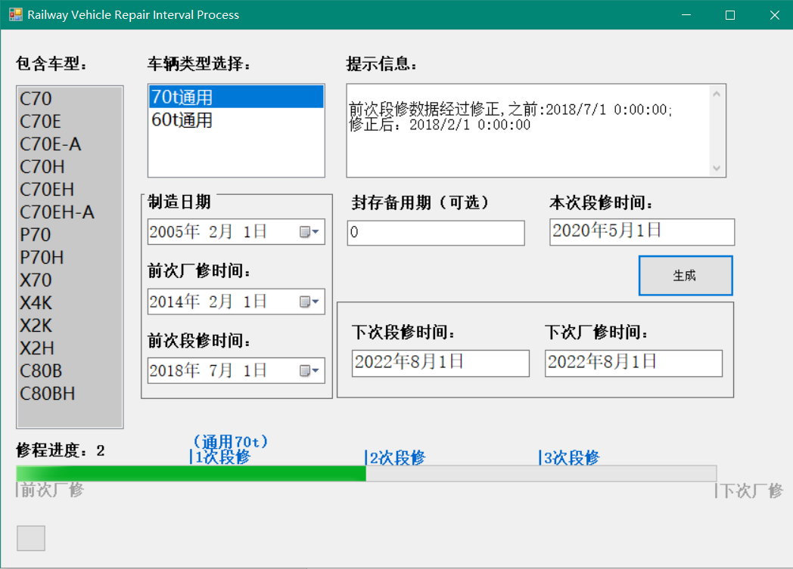

# 铁路货车修程修制计算开发文档（仅限参与改革车辆）
> Railway Vehicle Rapair Interval Process Program

## Instruction

输入车辆类型、制造日期、前次厂修日期、前次段修日期、封存期（Optional），点击生成即可计算出本次、下次厂段修，以及显示当前所处修程。



## Pre-Tips
如果您想在此Repository基础上构建```WPF```、```WebApp```等.Net平台程序，只需添加```RailwayVehicleModel```、```VehicleData```类，实例化***RailwayVehicleModel***，给***RailwayVehicleModel***下**5** 项属性赋值：

```
vehicleModel.GenTpSelection
vehicleModel.produceDate
vehicleModel.previousDepotDate
vehicleModel.previousFactoryDate
vehicleModel.SealDuration
```

再传递给***VehicleData.DateProcessKernel(RailwayVehicleModel vehicleModel)***，通过Kernel处理，返回***RailwayVehicleModel***实例，直接显示在UI即可。

## Reminder: 
**<font color=red>代码中不含有任何铁路车辆数据，不含有任何机密，不含有任何工作文件，不含有任何与国家铁路机密一切相关数据。</font>**

### And,this program is dedicated to provide convenience for China Railway Cause developers. It wouldn't be internationalized, the doc only provides Chinese.
### Additionally, Excel Batch Process Function would be written in next milestone version.


## Usage

如果你想查看、修改Kernel是如何工作的。那么请接着往下看。

VehicleData 静态类中***public static RailwayVehicleModel DateProcessKernel(RailwayVehicleModel vehicle)*** 是 **整个程序对修程时间进行计算、矫正的关键**。怎么处理的就不讲了，规则太多太负责了，下面的图只讲比较粗略的思路。请对着修程修制改革文件、代码进行学习。

大概思路是：


为了更便于参数管理，日后拓展程序功能，将Vehicle各项参数存放在Model类中。

> Tips：dateTime.AddMonths(2);不会覆盖dateTime的值，只会返回一个new instance。

***THE END***
